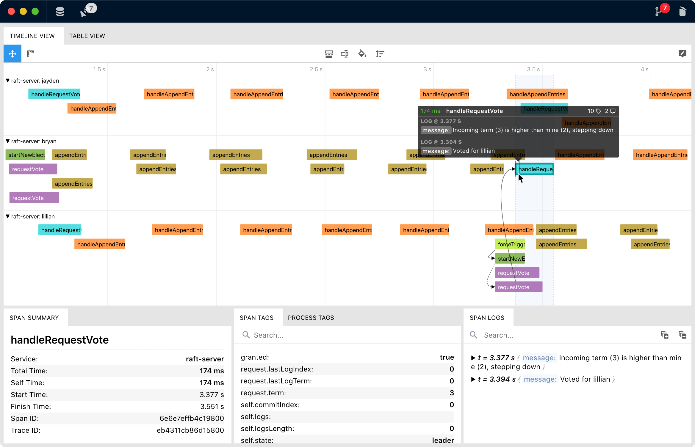
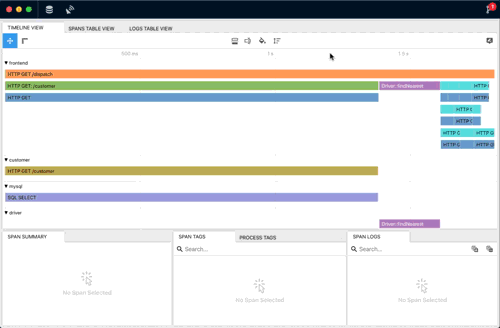
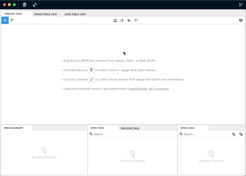

<h1 align="center">
    
  Stalk Studio
</h1>

**Stalk Studio** is a highly flexible trace analysis tool for Jaeger and Zipkin.

- Search & import traces directly from Jaeger and Zipkin services
- Drag & drop JSON trace files exported from Jaeger and Zipkin
- Intuitive UI for extracting useful information from complex traces
- Supports viewing & inspecting multiple traces on the same stage to give you a bigger perspective
- _and more..._

# Main Features

  <h3>:book: Tabular Perspective</h3>
  In addition to the timeline view, Stalk Studio provides table views for spans and logs to
  pinpoint interesting events quickly.
   
   
  

    • <strong>Customizable columns</strong>: add/remove columns for span tags, process tags, log fields
  

  

    • <strong>Sortable columns</strong>: sort spans by total time, self time, operation name, or any visible column 
  

  

    • <strong>Filter spans & logs</strong>
  

  

    • <strong>Flexible panes</strong>: split views can be handy
  

   

  <h3>:gear: High Customizability</h3>
  Stalk Studio is built for being as flexible as possible to cover your changing needs when analyzing different traces.
  You can customize the timeline in the following ways:
   
   
  

    • <strong>Span Grouping</strong>: The spans in the same group are drawn vertically together.
    You may think like horizontal lanes separated from each other. Uninteresting groups can be
    collapsed to prevent visual clutter.
  

  

    • <strong>Span Coloring</strong>: Change timeline span colors by operation name, service name,
    however you want.
  

  

    • <strong>Draw Layout</strong>: Change where spans should be rendered vertically.
  

  

    • <strong>Span Labelling</strong>: Change the text rendered on a span bar, if it has enough width to display.
  

  

    • <strong>Tooltip Contents</strong>: Change the contents of the tooltip displayed when you hover a span bar.
    You can add/remove interested span tags and process tags as your need.
  

  <h3>:woman_technologist: Built for developers in mind</h3>
  If the built-in customization options don't fill your needs, you can always write your own
  custom JavaScript / TypeScript code to do the following:
   
   
  

    • Change span grouping
  

  

    • Change span labeling
  

  

    • Change span coloring
  

  

    • Filter spans & logs in table views
  

   
   
   

  <h3>:satellite: Live Collector</h3>
  In addition to its analysis capabilities, Stalk Studio has built-in servers mimicking Jaeger
  and Zipkin collector interface. So if you have services that already instrumented
  with Jaeger and Zipkin, you can quickly capture & inspect low-volume traces just by changing
  the reporting URL of your instrumentations. It can be useful for debugging and development purposes.
   
   
  

    • <strong>Jaeger Agent</strong>: accepts jaeger.thrift in compact Thrift protocol over UDP.
  

  

    • <strong>Jaeger Collector</strong>: accepts jaeger.thrift in binary Thrift protocol over HTTP.
  

  

    • <strong>Zipkin Collector</strong>: accepts spans in JSON format over HTTP.
  

<!-- 
 -->

# Download

Go to [releases page](https://github.com/dgurkaynak/stalk-studio/releases).

# Building & Development

### Development

You must have node.js >= 12 installed on your machine.

- Clone the repo
- Install dependencies: `npm i`
- Get started with webpack-dev-server w/ live-reload: `npm start`

### Building

- Build the project in production mode: `npm run build`
- Package the electron project into an executable: `npm run package`
- Check out `/dist` folder for output

### Distribution

- Build the project in production mode: `npm run build`
- Make distribution files (_.dmg, _.AppImage, \*-setup.exe)
  - Generates distribution files for your platform: `npm run distribute`
  - Generate distribution files for Windows and Linux in Docker: `node ./scripts/electron-build-win-and-linux-on-docker.sh`
- Check out `/dist` folder for outputs
