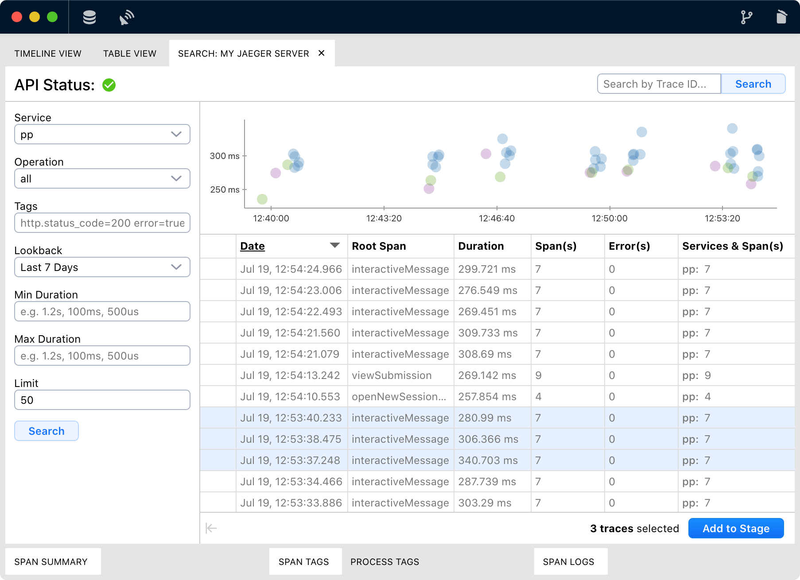
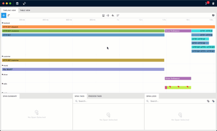
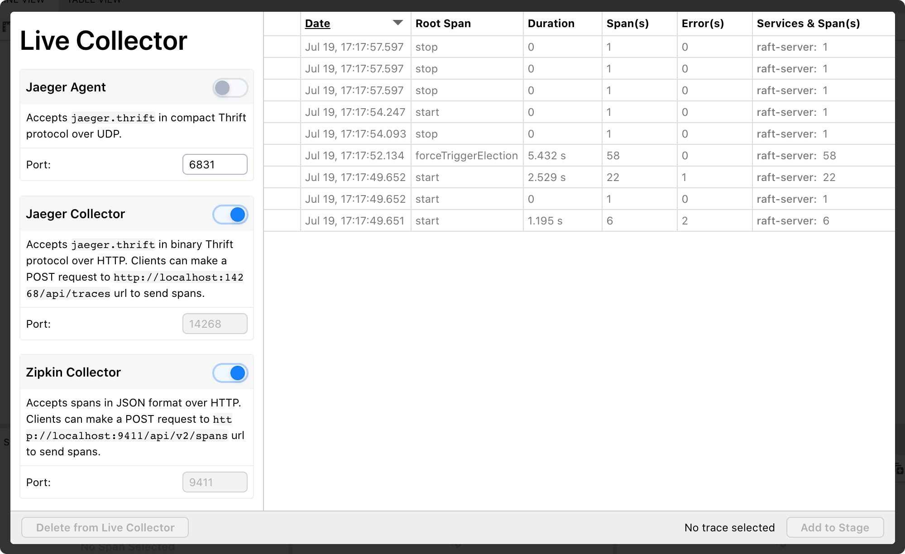
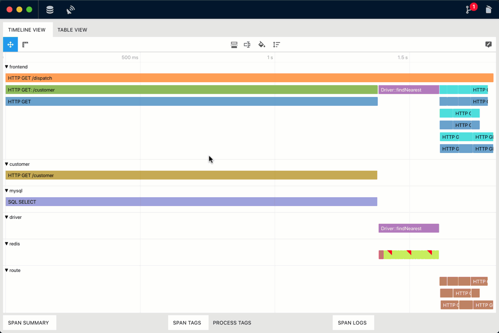

<h1 align="center">
    
  Stalk Studio
</h1>

**Stalk Studio** is an experimental debugger & profiler built on top of distributed tracing.

- Intuitive DevTools-like UI for extracting useful information from complex traces
- Visualize & inspect multiple traces on the same stage
- It supports [Jaeger](https://www.jaegertracing.io/) and [Zipkin](https://zipkin.io/) out of the box

# Background & Motivation

At work, we had a nasty bug in a highly event-driven, consensus-based distributed system. And it was occurring randomly on some specific cluster setups that we don't have physical access for debugging. Viewing the plain text dumps of the device logs couldn't help us to analyze the issue. And we thought, why not use distributed tracing for debugging? After a little research, we've decided to go with [OpenTracing](https://opentracing.io/), a vendor-neutral instrumentation specification. So we can try and swap between the most popular open-source distributed tracing solutions, [Jaeger](https://www.jaegertracing.io/) and [Zipkin](https://zipkin.io/). After instrumentation and collecting traces, we've found that Jaeger and Zipkin's built-in UI is quite limiting us since these tools aren't built for this use case. The most common use case of the distributed tracing is tracing just a single request that flows through multiple microservices. But we wanted to have a DevTools-like unified debugging experience since we are interested in the whole cluster's overall behavior, which consists of multiple traces. To simulate a similar scenario, I've also built [a demo app](https://github.com/dgurkaynak/stalk-demo-raft-consensus) that implements [Raft distributed consensus algorithm](https://en.wikipedia.org/wiki/Raft_(computer_science)), instrumented with OpenTracing.

So that's it, Stalk Studio's goal is to provide an alternative way to inspect distributed traces, especially for non-traditional use cases.

# Main Features

  <h3>:vulcan_salute: Jaeger and Zipkin support</h3>
  

    • Add & save your Jaeger and Zipkin APIs as data sources
  

  

    • Search & import traces directly from Jaeger and Zipkin
  

  

    • Drag & drop JSON trace files that are exported from Jaeger or Zipkin
  

 
 
 
 
 

  
  <h3>:gear: High Customizability</h3>
  Stalk Studio is built for being as flexible as possible to cover your changing needs when analyzing different traces.
   
   
  

    • <strong>Flexible panes</strong>: Split views can be handy.
  

  

    • <strong>Table view</strong>: Pinpoint interesting spans quickly in table view with customizable & sortable columns.
  

  

    • <strong>Timeline layout</strong>: Change how the spans are grouped and rendered vertically. Uninteresting groups can be collapsed to prevent visual clutter.
  

  

    • <strong>Span coloring & labelling</strong>: Change span bar colors and the text rendered on it.
  

  

    • <strong>Tooltip</strong>: Change the contents of the tooltip displayed when you hover a span bar. You can add/remove interested span tags, logs, and process tags.
  

  <h3>:satellite: Live Collector</h3>
  Stalk Studio has built-in servers mimicking Jaeger
  and Zipkin collector interface. So if you have services that already instrumented
  with Jaeger and Zipkin, you can quickly capture & inspect low-volume traces just by changing
  the reporting URL of your instrumentations. It can be useful for debugging and development purposes.
   
   
  

    • <strong>Jaeger Agent</strong>: accepts jaeger.thrift in compact Thrift protocol over UDP.
  

  

    • <strong>Jaeger Collector</strong>: accepts jaeger.thrift in binary Thrift protocol over HTTP.
  

  

    • <strong>Zipkin Collector</strong>: accepts spans in JSON format over HTTP.
  

  <h3>:woman_technologist: Built for developers in mind</h3>
  If the built-in customization options don't fill your needs, you can always write your own
  custom JavaScript / TypeScript code to do the following:
   
   
  

    • Filter spans
  

  

    • Change span grouping
  

  

    • Change span labeling
  

  

    • Change span coloring
  

# Download

Go to [releases page](https://github.com/dgurkaynak/stalk-studio/releases).

# Building & Development

### Development

You must have node.js >= 12 installed on your machine.

- Clone the repo
- Install dependencies: `npm i`
- Get started with webpack-dev-server w/ live-reload: `npm start`

### Building

- Build the project in production mode: `npm run build`
- Package the electron project into an executable: `npm run package`
- Check out `/dist` folder for output

### Distribution

- Build the project in production mode: `npm run build`
- Make distribution files (_.dmg, _.AppImage, \*-setup.exe)
  - Generates distribution files for your platform: `npm run distribute`
  - Generate distribution files for Windows and Linux in Docker: `node ./scripts/electron-build-win-and-linux-on-docker.sh`
- Check out `/dist` folder for outputs
